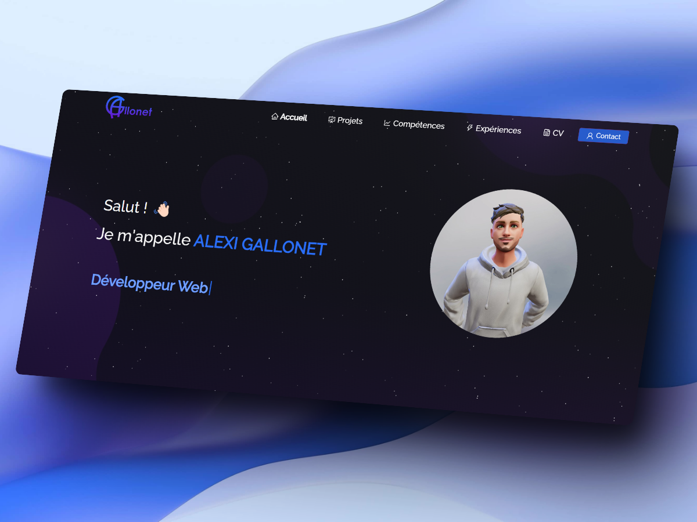
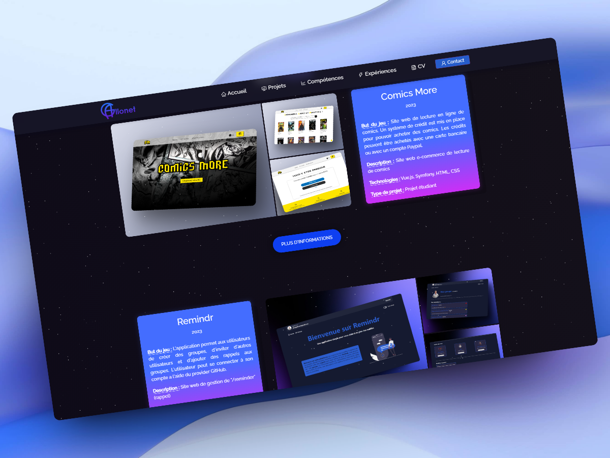
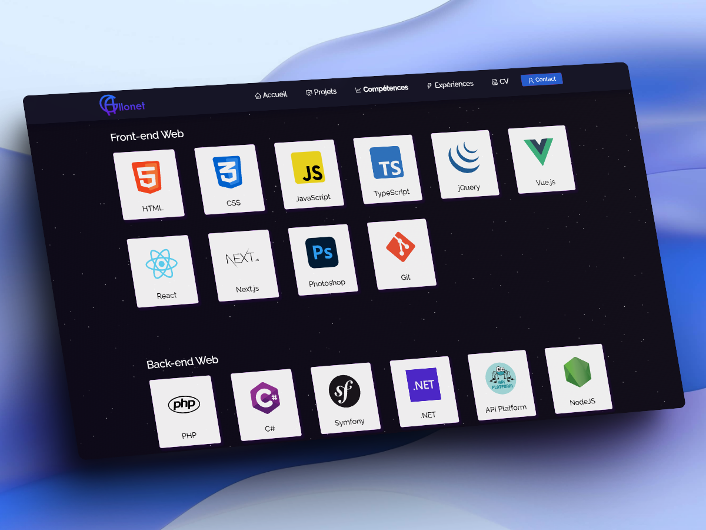

<h2 align="center">
  Portfolio - v2.0 
  <a href="https://alexigallonet.vercel.app/" target="_blank">alexi.gallonet</a>
</h2>

  
  
  

 

 &nbsp;
 &nbsp;
 &nbsp;

## Built With

Dans ce site, se trouve les projets que j'ai pu réaliser, les compétences que j'ai pu acquérir ainsi que les expériences que j'ai effectué.

Ce projet a été réalisé avec les technologies suivantes :

- React.js
- CSS3
- VsCode
- Vercel

## 🛠 Installation

1. Installation : `npm install`

2. Lancement en développement : `npm start`

Ouvrez ensuite le lien suivant : [http://localhost:3000](http://localhost:3000)

## Usage Instructions

Open the project folder and Navigate to `/src/components/`.  
You will find all the components used and you can edit your information accordingly.
